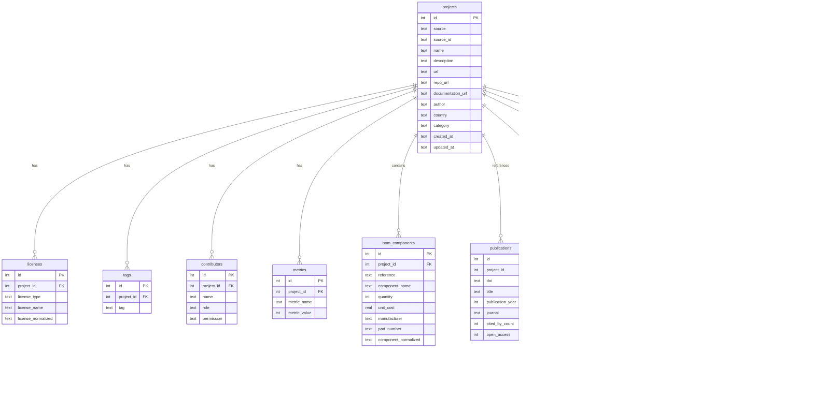

# OSH Datasets

Collect, clean, classify, and unify Open Source Hardware (OSH) project metadata from multiple sources into a single normalized SQLite database.

## Description

OSH Datasets aggregates metadata from 12 open-source hardware platforms and academic repositories. Raw data is scraped from each source, cleaned into standardized formats, and loaded into a unified SQLite database with a normalized schema. The pipeline supports cross-source deduplication, license normalization to SPDX identifiers, BOM component name normalization, and DOI enrichment.

<details>
<summary>Table of Contents</summary>

- [Data Sources](#data-sources)
- [Database Schema](#database-schema)
- [Current Database Stats](#current-database-stats)
- [Prerequisites](#prerequisites)
- [Installation](#installation)
- [Configuration](#configuration)
- [Quick Start](#quick-start)
- [Usage](#usage)
- [Project Structure](#project-structure)
- [Development](#development)
- [Contributing](#contributing)
- [License](#license)
- [Acknowledgments](#acknowledgments)

</details>

## Data Sources

| Source | Platform | Description | Auth Required |
|--------|----------|-------------|---------------|
| **Hackaday** | [hackaday.io](https://hackaday.io) | Community hardware projects with component lists | API keys |
| **OSHWA** | [oshwa.org](https://certification.oshwa.org) | OSHWA-certified hardware projects | JWT token |
| **HardwareX (OHX)** | [HardwareX journal](https://www.sciencedirect.com/journal/hardwarex) | Peer-reviewed hardware papers with BOM extraction | No |
| **Hardware.io** | [openhardware.io](https://openhardware.io) | Open hardware project registry with BOM data | No |
| **OHR** | [ohwr.org](https://ohwr.org) | CERN Open Hardware Repository (GitLab) | No |
| **OSF** | [osf.io](https://osf.io) | Open Science Framework project metadata | No |
| **Kitspace** | [kitspace.org](https://kitspace.org) | PCB project sharing platform with BOM data | No (optional Selenium) |
| **Mendeley Data** | [data.mendeley.com](https://data.mendeley.com) | Dataset metadata via OAI-PMH | No |
| **JOH** | Journal of Open Hardware | Journal article metadata | No |
| **PLOS** | [plos.org](https://plos.org) | Data availability statements and repo links | No |
| **OpenAlex** | [openalex.org](https://openalex.org) | Academic paper metadata by DOI | No |
| **GitHub** | [github.com](https://github.com) | Repository metrics for linked projects | Token |
| **GitLab** | [gitlab.com](https://gitlab.com) | Repository metrics for linked projects | Optional token |

## Database Schema



## Current Database Stats

| Table | Records |
|-------|--------:|
| projects | 10,698 |
| bom_components | 40,416 |

**Projects by source:** Hackaday (5,697), OSHWA (3,052), HardwareX (567), Hardware.io (515), OHR (247), OSF (208), Kitspace (186), Mendeley (178), JOH (29), PLOS (19)

**BOM components by source:** Hackaday (22,918), HardwareX (9,498), Hardware.io (4,715), Kitspace (3,285)


## Prerequisites

- Python >= 3.11
- [uv](https://docs.astral.sh/uv/) for package management

## Installation

```bash
# Clone the repository
git clone https://github.com/WeberLab-UW/OSH_Datasets.git
cd OSH_Datasets

# Create virtual environment and install
uv venv
uv pip install -e ".[dev]"

# For Selenium-based scraping (Kitspace full mode)
uv pip install -e ".[scrape]"
```

## Configuration

Create a `.env` file in the project root with your API credentials:

| Variable | Default | Description |
|----------|---------|-------------|
| `OSHWA_API_TOKEN` | -- | JWT token for OSHWA Certification API |
| `HACKADAY_API_KEYS` | -- | Comma-separated Hackaday.io API keys |
| `GITHUB_TOKEN` | -- | GitHub personal access token |
| `GITLAB_TOKEN` | -- | GitLab personal access token (optional) |
| `OPENALEX_EMAIL` | -- | Email for polite pool access (optional) |

```bash
# .env
OSHWA_API_TOKEN=your_jwt_token
HACKADAY_API_KEYS=key1,key2,key3
GITHUB_TOKEN=ghp_your_token
GITLAB_TOKEN=glpat_your_token
OPENALEX_EMAIL=you@example.com
```

## Quick Start

```bash
# Load all cleaned data into SQLite (no API keys needed)
uv run python -m osh_datasets.load_all

# Query the database
uv run python -c "
from osh_datasets.db import open_connection
from osh_datasets.config import DB_PATH
conn = open_connection(DB_PATH)
for r in conn.execute('SELECT source, COUNT(*) FROM projects GROUP BY source').fetchall():
    print(f'{r[0]}: {r[1]}')
conn.close()
"
```

## Usage

### Scrape raw data

```bash
# Run all scrapers
uv run python -m osh_datasets.scrape_all

# Run specific sources
uv run python -m osh_datasets.scrape_all oshwa ohr hackaday
```

### Load into database

```bash
# Initialize the database and load all cleaned data
uv run python -m osh_datasets.load_all
```

Post-processing runs automatically after loading: license normalization, component name normalization, DOI backfilling, cross-source deduplication, and GitHub enrichment.

### Enrich with GitHub metadata

The GitHub enrichment pipeline fetches repository metrics, community health, and detects BOM files for projects with GitHub repo URLs. Requires `GITHUB_TOKEN` in `.env`.

```bash
# Scrape GitHub metadata (auto-generates repos.txt from DB)
uv run python -m osh_datasets.scrape_all github

# Enrich: update existing projects with scraped GitHub data
uv run python -m osh_datasets.enrichment.github
```

### Pipeline

The full pipeline: **scrape** (raw JSON) -> **clean** (standardized CSV) -> **load** (SQLite) -> **enrich** (normalization, dedup, GitHub metadata).

```
data/
  raw/<source>/       # Scraper output (JSON per source)
  cleaned/<source>/   # Standardized CSV files
  osh_datasets.db     # Unified SQLite database
```

## Project Structure

```
src/osh_datasets/
    config.py                 # Paths, logging, environment helpers
    db.py                     # SQLite schema, connection management, upsert helpers
    http.py                   # Shared HTTP session with retry and rate limiting
    token_manager.py          # API token rotation (GitHub, GitLab, Hackaday)
    scrape_all.py             # Scraper orchestrator
    load_all.py               # Loader orchestrator + post-processing pipeline
    dedup.py                  # Cross-source deduplication via repo URL matching
    license_normalizer.py     # Map free-text licenses to SPDX identifiers
    component_normalizer.py   # Normalize BOM component names (units, case, unicode)
    enrich_ohx_dois.py        # DOI backfilling for HardwareX publications
    scrapers/                 # 13 scraper modules (one per source)
        base.py               # BaseScraper ABC
        oshwa.py  ohr.py  hackaday.py  kitspace.py  hardwareio.py
        ohx.py  osf.py  plos.py  openalex.py  mendeley.py
        github.py  gitlab.py
    loaders/                  # 11 loader modules (one per source)
        base.py               # BaseLoader ABC
        hackaday.py  oshwa.py  ohr.py  kitspace.py  hardwareio.py
        ohx.py  osf.py  plos.py  mendeley.py  joh.py
    enrichment/               # Post-scrape enrichment modules
        github.py             # GitHub metadata -> repo_metrics, BOM detection
tests/
    test_db.py                # Database schema and helper tests
    test_loaders.py           # Loader integration tests
    test_scrapers.py          # Scraper unit tests (mocked HTTP)
    test_enrichment.py        # GitHub enrichment pipeline tests
    test_component_normalizer.py  # Component name normalizer tests
```

## Development

```bash
# Run all tests
uv run pytest tests/ -v

# Run a single test file
uv run pytest tests/test_component_normalizer.py -v

# Type checking
uv run mypy src/

# Lint and format
uv run ruff check src/ tests/
uv run ruff format src/ tests/
```

### Adding a new source

1. Create `scrapers/<source>.py` subclassing `BaseScraper` with `source_name` and `scrape() -> Path`
2. Register in `scrapers/__init__.py:ALL_SCRAPERS`
3. Create `loaders/<source>.py` subclassing `BaseLoader` with `source_name` and `load(db_path) -> int`
4. Register in `load_all.py:ALL_LOADERS`
5. Add mocked tests in `tests/test_scrapers.py` and `tests/test_loaders.py`

## Contributing

See [CONTRIBUTING.md](CONTRIBUTING.md) for details on reporting bugs, suggesting features, and submitting pull requests.

## License

This project is licensed under the MIT License. See [LICENSE](LICENSE) for details.

## Acknowledgments

- Data sourced from OSHWA, Hackaday.io, CERN OHR, Kitspace, OpenHardware.io, HardwareX, OSF, PLOS, OpenAlex, Mendeley Data, and JOH
- Built with [polars](https://pola.rs/), [orjson](https://github.com/ijl/orjson), [Beautiful Soup](https://www.crummy.com/software/BeautifulSoup/), and [requests](https://requests.readthedocs.io/)
