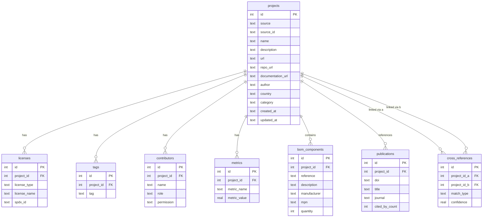

# OSH Datasets

Collect, clean, classify, and unify Open Source Hardware (OSH) project metadata from multiple sources into a single normalized SQLite database.

## Overview

OSH Datasets aggregates metadata from 11 open-source hardware platforms and academic repositories. Raw data is scraped from each source, cleaned into standardized CSV files, and loaded into a unified SQLite database with a normalized schema. The pipeline supports deduplication across sources, license normalization, and DOI enrichment.

## Data Sources

| Source | Platform | Description | Auth Required |
|--------|----------|-------------|---------------|
| **OSHWA** | [oshwa.org](https://certification.oshwa.org) | OSHWA-certified hardware projects | JWT token |
| **OHR** | [ohwr.org](https://ohwr.org) | CERN Open Hardware Repository (GitLab) | No |
| **Hackaday** | [hackaday.io](https://hackaday.io) | Community hardware projects with key rotation | API keys |
| **Kitspace** | [kitspace.org](https://kitspace.org) | PCB project sharing platform | No (optional Selenium) |
| **Hardware.io** | [openhardware.io](https://openhardware.io) | Open hardware project registry | No |
| **HardwareX** | [HardwareX journal](https://www.sciencedirect.com/journal/hardwarex) | Peer-reviewed hardware papers (XML) | No |
| **OSF** | [osf.io](https://osf.io) | Open Science Framework project metadata | No |
| **PLOS** | [plos.org](https://plos.org) | Data availability statements and repo links | No |
| **OpenAlex** | [openalex.org](https://openalex.org) | Academic paper metadata by DOI | No |
| **GitHub** | [github.com](https://github.com) | Repository metadata for linked projects | Token |
| **GitLab** | [gitlab.com](https://gitlab.com) | Repository metadata for linked projects | Optional token |

## Database Schema



## Installation

Requires Python 3.11+.

```bash
# Clone the repository
git clone https://github.com/your-org/OSH_Datasets.git
cd OSH_Datasets

# Create virtual environment and install
uv venv
uv pip install -e ".[dev]"

# For Selenium-based scraping (Kitspace full mode)
uv pip install -e ".[scrape]"
```

## Configuration

Create a `.env` file in the project root with your API credentials:

```
OSHWA_API_TOKEN=your_jwt_token
HACKADAY_API_KEYS=key1,key2,key3
GITHUB_TOKEN=ghp_your_token
GITLAB_TOKEN=glpat_your_token
OPENALEX_EMAIL=you@example.com
```

## Usage

### Scrape raw data

```bash
# Run all scrapers
python -m osh_datasets.scrape_all

# Run specific sources
python -m osh_datasets.scrape_all oshwa ohr hackaday
```

### Load into database

```bash
# Initialize the database and load all cleaned data
python -m osh_datasets.load_all

# Load specific sources
python -m osh_datasets.load_all oshwa hackaday kitspace
```

### Pipeline

The full pipeline is: **scrape** (raw JSON) -> **clean** (standardized CSV) -> **load** (SQLite).

```
data/
  raw/          # Scraper output (JSON per source)
  cleaned/      # Standardized CSV files
  osh_datasets.db   # Unified SQLite database
```

## Project Structure

```
src/osh_datasets/
    config.py             # Paths, logging, environment helpers
    db.py                 # SQLite schema, connection management, upsert helpers
    http.py               # Shared HTTP session with retry and rate limiting
    token_manager.py      # API token rotation (GitHub, GitLab, Hackaday)
    scrape_all.py         # Scraper orchestrator
    load_all.py           # Loader orchestrator
    dedup.py              # Cross-source deduplication
    license_normalizer.py # SPDX license standardization
    enrich_ohx_dois.py    # DOI enrichment for HardwareX articles
    scrapers/             # One module per data source (11 scrapers)
        base.py           # BaseScraper ABC
    loaders/              # One module per data source (9 loaders)
        base.py           # BaseLoader ABC
tests/
    test_loaders.py       # Loader unit tests
    test_scrapers.py      # Scraper unit tests (mocked HTTP)
```

## Development

```bash
# Run tests
uv run pytest tests/ -v

# Type checking
uv run mypy src/

# Lint and format
uv run ruff check src/ tests/
uv run ruff format src/ tests/
```

## License

This project is licensed under the MIT License. See [LICENSE](LICENSE) for details.
